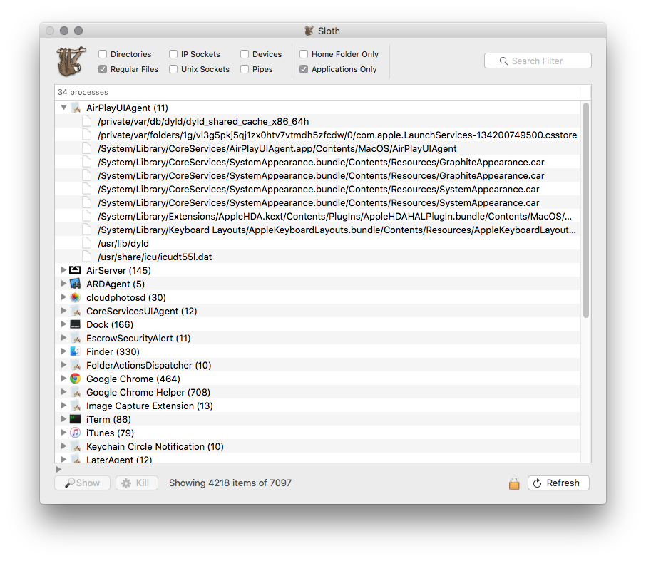

# Sloth


Sloth is an OS X application that displays a list of all open files and sockets in use by all running applications on your system. This makes it easy to see which apps are using which files and sockets.

Sloth is basically a GUI on top of the powerful `lsof` command line tool. The output of `lsof` is parsed and shown in a searchable, filterable table view with some convenient user friendly functionality such as revealing files in the Finder, killing a file's owning process, etc. See screenshots.

## Download

* [Download Sloth 1.6](http://sveinbjorn.org/files/software/sloth.zip) (~0.5 MB, Intel 64-bit only)

## Requirements

* Intel 64-bit Mac
* OS X 10.8 or later

## Screenshots



## Version history

###24/02/2016 - Version 1.6

* Asynchronous refresh
* Much improved performance
* UI improvements
* New filtering options
* Smarter regex filtering
* Load results as root without restart
* Expanded sorting options
* Migrated project to ARC, modern Objective-C and XCode 7
* Substantial rewrite
* Now requires OS X 10.8 or later

###08/07/2010 - Version 1.5

* Column sorting, column rearrangement
* Several bug fixes
* Copy/Drag and drop

###29/05/2009 - Version 1.4

* Regular expression search filtering
* New "Relaunch as root" option
* Fixed bug in Mac OS X 10.5
* Now built for Mac OS X 10.4 or later

###28/07/2006 - Version 1.3.1

* Released as a Universal Binary

###05/03/2004 - Version 1.3

* Live update on search filter
* Sorting in columns now works
* Performance improvements
* The timed update feature is non-functional for the time being
* Lots of code replaced by Cocoa bindings thanks to Bill Bumgarner

###27/02/2004 - Version 1.2

* Filter search field now counts all list fields when filtering
* Auto-refresh timer option
* Preferences for setting arbitrary lsof binary and kill signal type
* New application icon
* Added Icelandic and Japanese localizations

###22/02/2004 - Version 1.1

* There is now a search field filter for entries in list. No type-in update.
* "Actions" menu with menu items and shortcuts for button actions

###21/02/2004 - Version 1.0

## BSD License 

````
Copyright (C) 2004-2016 Sveinbjorn Thordarson <sveinbjornt@gmail.com>

Redistribution and use in source and binary forms, with or without modification,
are permitted provided that the following conditions are met:

1. Redistributions of source code must retain the above copyright notice, this
list of conditions and the following disclaimer.

2. Redistributions in binary form must reproduce the above copyright notice, this
list of conditions and the following disclaimer in the documentation and/or other
materials provided with the distribution.

3. Neither the name of the copyright holder nor the names of its contributors may
be used to endorse or promote products derived from this software without specific
prior written permission.

THIS SOFTWARE IS PROVIDED BY THE COPYRIGHT HOLDERS AND CONTRIBUTORS "AS IS" AND
ANY EXPRESS OR IMPLIED WARRANTIES, INCLUDING, BUT NOT LIMITED TO, THE IMPLIED
WARRANTIES OF MERCHANTABILITY AND FITNESS FOR A PARTICULAR PURPOSE ARE DISCLAIMED.
IN NO EVENT SHALL THE COPYRIGHT HOLDER OR CONTRIBUTORS BE LIABLE FOR ANY DIRECT,
INDIRECT, INCIDENTAL, SPECIAL, EXEMPLARY, OR CONSEQUENTIAL DAMAGES (INCLUDING, BUT
NOT LIMITED TO, PROCUREMENT OF SUBSTITUTE GOODS OR SERVICES; LOSS OF USE, DATA, OR
PROFITS; OR BUSINESS INTERRUPTION) HOWEVER CAUSED AND ON ANY THEORY OF LIABILITY,
WHETHER IN CONTRACT, STRICT LIABILITY, OR TORT (INCLUDING NEGLIGENCE OR OTHERWISE)
ARISING IN ANY WAY OUT OF THE USE OF THIS SOFTWARE, EVEN IF ADVISED OF THE
POSSIBILITY OF SUCH DAMAGE.
````