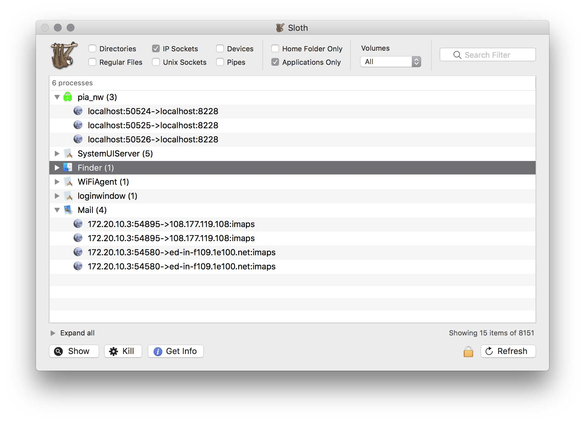
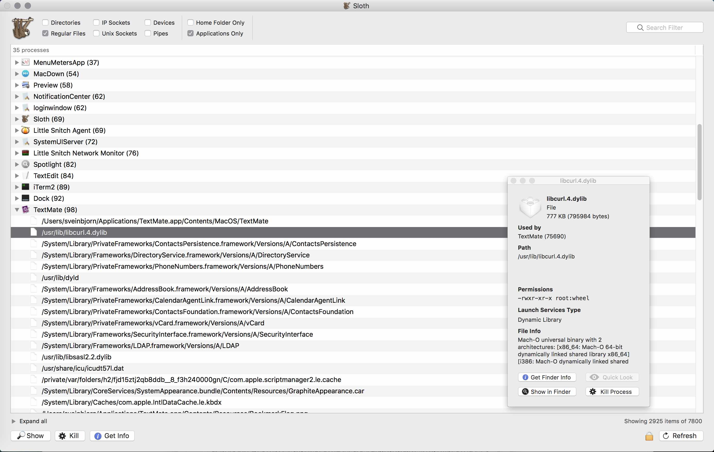
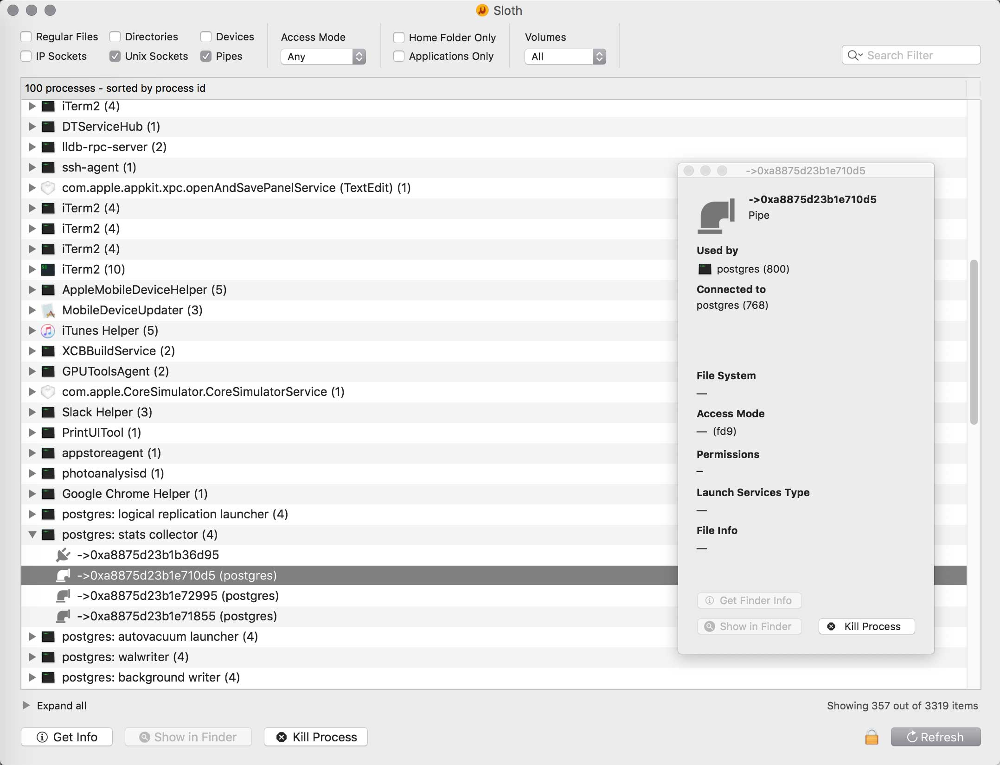

[](https://opensource.org/licenses/BSD-3-Clause)
[]()
[]()

# Sloth


**Sloth** is a native Mac app that shows all open files, directories, sockets, pipes, and devices in use by all running processes on your system. This makes it easy to inspect which apps are using which files, etc.

* View all open files, directories, IP sockets, devices, Unix domain sockets, and pipes
* Filter by name, access mode, volume, type, location, or using regular expressions
* Sort by process name, file count, type, process ID, user ID, Carbon PSN, bundle UTI, etc.
* View IP socket status, protocol, port and version
* View sockets and pipes established between processes
* Inspection window with detailed macOS and Unix file/socket/process info
* Powerful contextual menu for file operations
* In-app authentication to run with root privileges
* Very fast, responsive native app written in Objective-C/Cocoa

Sloth is essentially a friendly, exploratory graphical user interface built on top of the  [`lsof`](https://en.wikipedia.org/wiki/Lsof) command line tool. The output of `lsof` is parsed and shown in a searchable, filterable outline view with all sorts of convenient additional functionality. Check out the screenshots below.

## Download

<a href="https://www.paypal.com/cgi-bin/webscr?cmd=_s-xclick&hosted_button_id=BDT58J7HYKAEE"></a>

Sloth is free, open source software and has been continuously developed and maintained for a very long time (since 2004).
**If you find this program useful, please [make a donation](https://sveinbjorn.org/donations).**

*  **[⇩ Download Sloth 3.1](https://sveinbjorn.org/files/software/sloth.zip)** (~1.2 MB, Universal ARM/Intel 64-bit, macOS 10.9 or later)

Sloth can also be installed via [Homebrew](https://brew.sh) (may not be latest version):

```shell
$ brew install --cask sloth
```

Old versions supporting macOS 10.8 and earlier can be downloaded [here](https://sveinbjorn.org/files/software/sloth/).


## Screenshots

#### View open files

<a href="resources/sloth_screenshot1.jpg">

</a>

#### IPv4/IPv6 sockets

<a href="resources/sloth_screenshot2.jpg">

</a>

#### Sockets and pipes between processes

<a href="resources/sloth_screenshot3.jpg">

</a>

## Build

Sloth can be built using a reasonably modern version of Xcode via the `xcodeproj` or by running the following command in the repository root (requires Xcode build tools):

```
make
```

Built products are created in `products/`.

## Version history

### 18/03/2021 - Version 3.1

* Configurable refresh interval
* Default (regex) filters can be set in Preferences
* Fixed filtering by volume on Catalina and Big Sur
* Various minor bug fixes and interface improvements

### 26/11/2020 - Version 3.0.1

* Fixed crash bug on macOS Big Sur

### 24/11/2020 - Version 3.0

* Universal binary supporting Apple's arm64 architecture
* New square icon for Big Sur
* Info Panel now shows volume name and mount point for file system items
* New "Show Package Contents" contextual menu item for bundles
* Various minor fixes and performance improvements
* Now requires macOS 10.9 or later

### 27/02/2020 - Version 2.9

* Sort by process type, bundle identifier or Carbon Process Serial Number
* Better handling of errors in lsof output

### 30/03/2019 - Version 2.8.1

* Fixed potential crash bug introduced in version 2.8.

### 27/03/2019 - Version 2.8

* New Dark Mode friendly template icons for Mojave
* Multiple items can now be selected and copied
* Info Panel now shows which processes are connected to each other via unix pipes & domain sockets
* Info Panel now also shows file system info such as device name & inode
* Cmd-L menu action to show selected item
* Minor performance improvements
* Sparkle update framework now has Mojave Dark Mode-compatible appearance
* No longer shows hidden volumes in Volumes filter
* Fixed issue with mangled process names
* Fixed issue with pipe icon on non-retina displays
* Fixed minor memory leak
* More graceful error handling when file descriptor lookup fails in lsof

### 10/02/2019 - Version 2.7

* Info Panel now shows file Uniform Type Identifier
* Fixed crash bug on macOS 10.9 and earlier
* Various minor bug fixes and interface improvements

### 26/09/2018 - Version 2.6

* New and improved contextual menu 
* Fixed quirks with macOS Mojave's "Dark Mode"
* Various user interface improvements

### 02/06/2018 - Version 2.5

* Fixed critical lsof output parsing bug introduced in 2.4
* New "Authenticate on launch" option in Preferences
* Various minor interface refinements

### 10/05/2018 - Version 2.4

* Now defaults to showing Mac-friendly process names (e.g. "Safari Web Content" instead of "com.apple.WebKit.WebContent")
* Unix process names no longer truncated to 32 characters
* Search filter can now be used to filter by IP protocol (e.g. TCP or UDP) or IP version (e.g. IPv4 or IPv6)
* Now shows TCP socket state (e.g. LISTEN, ESTABLISHED) in list and Info Panel
* Info Panel now shows file descriptor integer
* Info Panel now shows additional info for character devices
* Info Panel now shows Carbon Process Serial Number (PSN) for processes, if available
* Much improved IPv6 socket handling
* DNS to IP and port name resolution in Info Panel when DNS/port lookup enabled in Prefs
* Minor user interface enhancements

### 16/04/2018 - Version 2.3

* Now supports access mode filtering (e.g. read, write, read/write)
* Search filter now also filters by PID
* DNS and port name lookup for IP Sockets in Info Panel
* Info Panel now identifies standard I/O stream character devices
* New Search Filter menu with case sensitivity and regex options
* New application icon
* Fixed bug where Volumes filter wouldn't work
* Minor interface improvements

### 07/03/2018 - Version 2.2

* Now defaults to excluding process binaries, shared libraries and current working directories in listing
* DNS and port name lookup now disabled by default for faster execution (can be enabled in Preferences)
* Info Panel now displays file access mode and process owner
* New sort option: User ID
* Info Panel now shows IP socket protocol and version
* New Preferences window
* New high-resolution pipe and socket icons
* Fixed bug where sort settings were not respected on launch

### 12/02/2018 - Version 2.1

* Copying a file path now creates a file representation in clipboard in addition to text
* File paths are now red in colour if selected file does not exist at path
* Uniform Type Identifier now used to identify app bundles instead of .app suffix
* Fixed issue with Info Window's handling of moved or non-existent files
* Minor interface refinements

### 01/10/2017 - Version 2.0

* New Volumes filter
* New "Sort By" submenu under View in main menu
* Sorting by PID now correctly does numerical sort instead of alphabetic

### 07/06/2017- Version 1.9

* Files can now be dragged and dropped
* Cmd-F now focuses on filter field
* File representations can now be copied to the clipboard
* Cmd-double-click now reveals file in Finder
* Fixed various minor user interface bugs
* Fixed collapse all bug with Info Panel open
* New compact interface size option
* Fixed broken permissions display for non-bundle processes in Info Panel

### 03/05/2017 - Version 1.8

* Sloth is now code-signed
* QuickLook now works from the Info panel
* Minor user interface improvements

### 17/06/2016 - Version 1.7

* New Info Panel for items
* Minor UI changes

### 24/02/2016 - Version 1.6

* Asynchronous refresh
* Much improved performance
* UI improvements
* New filtering options
* Smarter regex filtering
* Load results as root without relaunching application
* Expanded sorting options
* Migrated project to ARC, modern Objective-C and Xcode 7
* Now requires OS X 10.8 or later

### 08/07/2010 - Version 1.5

* Column sorting, column rearrangement
* Several bug fixes
* Copy/drag and drop selected items

### 29/05/2009 - Version 1.4

* Regular expressions in search filter
* New "Relaunch as root" option
* Fixed bug in Mac OS X 10.5
* Now built for Mac OS X 10.4 or later

### 28/07/2006 - Version 1.3.1

* Released as a Universal Binary

### 05/03/2004 - Version 1.3

* Live update for search filter
* Sorting by column now works
* Performance improvements
* Lots of code replaced by Cocoa bindings thanks to Bill Bumgarner

### 27/02/2004 - Version 1.2

* Filter search field now tries to match all fields when filtering
* Added auto-refresh timer option
* lsof binary and kill signal type can now be set in Preferences
* New application icon
* Added Icelandic and Japanese localizations

### 22/02/2004 - Version 1.1

* Added search filter.
* New Action menu with menu items and shortcuts for button actions

### 21/02/2004 - Version 1.0

## BSD License 

Copyright (C) 2004-2021 Sveinbjorn Thordarson &lt;<a href="mailto:">sveinbjorn@sveinbjorn.org</a>&gt;

Redistribution and use in source and binary forms, with or without modification,
are permitted provided that the following conditions are met:

1. Redistributions of source code must retain the above copyright notice, this
list of conditions and the following disclaimer.

2. Redistributions in binary form must reproduce the above copyright notice, this
list of conditions and the following disclaimer in the documentation and/or other
materials provided with the distribution.

3. Neither the name of the copyright holder nor the names of its contributors may
be used to endorse or promote products derived from this software without specific
prior written permission.

THIS SOFTWARE IS PROVIDED BY THE COPYRIGHT HOLDERS AND CONTRIBUTORS "AS IS" AND
ANY EXPRESS OR IMPLIED WARRANTIES, INCLUDING, BUT NOT LIMITED TO, THE IMPLIED
WARRANTIES OF MERCHANTABILITY AND FITNESS FOR A PARTICULAR PURPOSE ARE DISCLAIMED.
IN NO EVENT SHALL THE COPYRIGHT HOLDER OR CONTRIBUTORS BE LIABLE FOR ANY DIRECT,
INDIRECT, INCIDENTAL, SPECIAL, EXEMPLARY, OR CONSEQUENTIAL DAMAGES (INCLUDING, BUT
NOT LIMITED TO, PROCUREMENT OF SUBSTITUTE GOODS OR SERVICES; LOSS OF USE, DATA, OR
PROFITS; OR BUSINESS INTERRUPTION) HOWEVER CAUSED AND ON ANY THEORY OF LIABILITY,
WHETHER IN CONTRACT, STRICT LIABILITY, OR TORT (INCLUDING NEGLIGENCE OR OTHERWISE)
ARISING IN ANY WAY OUT OF THE USE OF THIS SOFTWARE, EVEN IF ADVISED OF THE
POSSIBILITY OF SUCH DAMAGE.

The Sloth application icon is copyright (C) [Drífa Thoroddsen](https://drifaliftora.is).
